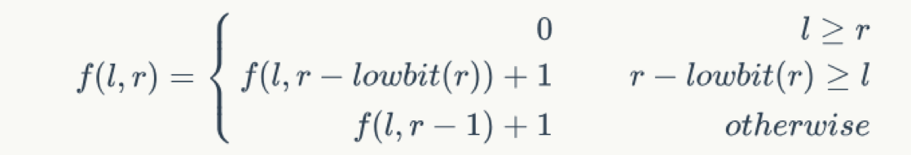
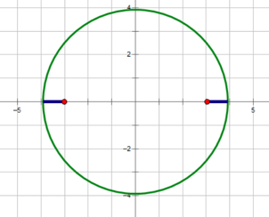

2018 CodeM初赛B轮

1. \[编程|500分\] 开关灯
```
美团的办公室一共有n层，每层有m个会议室，可以看成是一个n*m的网格图。工程师们每天的工作需要协作的地方很多，经常要到会议室开会解决各种问题。公司是提倡勤俭节约的，因此每次会议室只在使用时才开灯。
当一个工程师进入会议室时，假设没有其他人，他会把灯打开。
当一个工程师离开会议室时，假设没有其他人，他会把灯关掉。
现在给出一系列工程师进出会议室的记录，请问在此过程中，最多有多少会议室的灯是亮着的？请输出亮灯数最多时，每个会议室的明暗状态。
输入描述:
第一行三个整数n，m，k，分别表示总行数、总列数、工程师的进出记录数。
接下来k行，每行三个整数和一个字符串x, y, z, t，表示t时间点有一条记录，z=0表示x行y列的会议室有个工程师进入会议室了，z=1表示x行y列的房间有个工程师离开会议室了。
假设一开始所有会议室里都是没人的。
1 <= n, m <= 500
1 <= k <= 100,000
t是HH:MM:SS.SSS的形式，其中HH表示小时，MM表示分钟，SS.SSS表示秒数。（因为工程师有非常强大的时间观念，所以对于他们来说，时间是精确到0.001秒的）
数据保证t在18:00:00.000到23:59:59.999之间，且没有两条记录的时间是完全一样的。数据不保证记录以t升序的形式给出。
1 <= x <= n
1 <= y <= m
z∈{0, 1}
数据保证没有从空会议室离开的情况。
数据保证所有的时间格式合法。HH，MM均为长度为2的字符串，SS.SSS为长度为6的字符串。
输出描述:
输出n行每行m个整数，第i行第j列表示在亮灯数最多的时刻，第i行第j列的会议室的亮灯情况，1表示亮着，0表示没亮。
如果存在多次亮灯数最多的时刻，输出最后一次时的情况。
示例1
输入
2 2 4
1 1 0 18:00:00.000
1 1 1 20:00:00.000
1 1 0 18:00:01.000
1 2 0 18:00:02.000
输出
11
00
```

2. \[编程|1000分\] 配送
```
配送员每天都在为人们美好的生活辛勤工作。
在某位同城配送员的时刻表上，有n个任务，表示他在某年某月某一刻必须出现在某地把包裹交到对应的顾客手上。
配送员需要通过公共交通在城市里穿梭。在这个城市里，有m条公交线路，这些公交线路都是直达的（在起点和终点之间不存在其他站点），每天每条线路都有固定的发车和到达时间，还有搭乘它们的价格。城市里有k个关键点，所有任务的目标点以及所有线路的起终点都在这些关键点上。
现在问，在能保证所有任务准时完成的情况下，最少需要花费多少金钱。
输入描述:
第一行三个正整数n, m, k分别表示配送任务数、公交线路数以及城市中包含的关键点点数。
接下来n行，每行一个整数x和一个字符串t，表示需要在恰好t时刻把一个包裹送到下标为x的地点（顾客不会提早到达预定地点，也不能容忍配送员迟到，所以如果配送员早到的话，他需要等到时刻t）。数据不保证任务以t升序的形式给出。
接下来m行，每行三个整数和两个字符串S, T, p, t1，t2，表示S到T有一条价格为p的公交线路，这条线路在每天的t1时刻发车，在t2时刻到达。这些线路都是单向的。
1 <= n <= 10
1 <= m <= 500
1 <= k <= 100
1 <= x <= k
t是Year.Month.Day HH:MM:SS.SSS的形式，其中Year表示年份，Month表示月份，Day表示日期，HH表示小时，MM表示分钟，SS.SSS表示秒数。Day和HH之间是一个空格。数据保证t在2018.07.01 00:00:00.000到2018.07.07 23:59:59.999之间。假设现在的时间是2018.06.30 23:59:59.999，配送员正在1号点上。
数据保证没有两个任务的交货时间是同时的，因此不会发生冲突。
1 <= S, T <= k, S != T
0 < p <= 1,000
数据保证t1、t2在00:00:00.000到23:59:59.999之间，且都是当日出发，当日结束的行程（即t2 > t1）。
对于每个任务，司机需要在严格小于预约时间的时刻到达，在严格大于预约时间的时刻离开。
在这个问题中，不用考虑路上可能的延误。对于行程之间的接续，需要保证后一个行程的起始时间严格大于前一个行程的到达时间。
我们并不在意配送员最后在哪一个地点。
数据保证所有的时间格式合法。Month，Day，HH，MM均为长度为2的字符串，SS.SSS为长度为6的字符串，Year为长度为4的字符串。
输出描述:
输出一个整数表示最少需要花费的金钱。
如果不能完成所有任务，请输出-1。
示例1
输入
2 4 5
1 2018.07.01 10:00:00.000
5 2018.07.02 10:00:00.000
1 2 500 16:00:00.000 17:00:00.000
2 5 500 00:00:00.000 02:00:00.000
2 3 100 20:00:00.000 21:00:00.000
3 5 100 08:00:00.000 09:00:00.000
输出
700
说明
配送员有两个任务，他先等在1号地点完成任务1，然后依次通过行程1、3、4到达5号地点完成任务，一共花费700的金钱。
```

3. \[编程|1000分\] 低位值
```
定义lowbit(x) =x&(-x)，即2^(p-1) (其中p为x的二进制表示中，从右向左数第一个1的位置)，例如lowbit(10)=2，lowbit(3)=1。
定义函数f(l, r)为（其中0 <= l, r <= n）：

输入n，求f(l, r)的最大值。
输入描述:
n以二进制形式给出，一行一个二进制01串n，表示l，r的上界。
1 <= 字符串n的长度 <= 20,000
数据保证没有前缀0。
输出描述:
一行一个整数表示答案。
示例1
输入
11
输出
2
说明
二进制串“11”对应的十进制数为“3”
```


4. \[编程|1500分\] 神奇盘子
```
有一个神奇的盘子，形状为圆形。盘子上面爬着一个大象（视作一个点）。由于现实的扭曲，当大象在盘子某个直径的一端的时候，可以瞬间传送至直径的另一端。现在大象想去盘子上另外一点，问他最少需要移动多少距离。传送不计距离。
输入描述:
第一行一个整数r（1 <= r <= 1000）代表盘子的半径。
接下来两行两个整点分别代表大象所在的位置和大象目标的位置坐标。保证两个点都在圆内（可能在边界上），圆心在点(0, 0)上。
输出描述:
输出一个实数，代表大象最短需要移动多少距离。和标程相对或绝对相差1e-6都算正确。
示例1
输入
1
0 1
0 -1
输出
0.000000000000
示例2
输入
4
3 0
-3 0
输出
2.000000000000
说明

示例3
输入
100
-59 76
3 69
输出
62.393909959226
```



5. \[编程|2000分\] 魔法排序
```
在海拉尔某处存在着写有0到255（含）的整数的256块石板排成一列，每个整数恰出现一次。你拥有三种魔法，交换魔法可以交换写有a和b的石板（a和b为固定数字且不超过31，无法自选）；异或魔法可以把每块石板上的数字异或你任选的一个1到255之间的数字；加魔法可以把每块石板上的数字加上你任选的一个1到255之间的数字，结果模256。
你的目的是将石板整理成升序（即0,1, ..., 255）。三种魔法的使用顺序没有限制。
输入描述:
第一行两个不同的整数a和b，0 <= a, b <= 31。
第二行256个整数，为一个0,1, ..., 255的排列。
输出描述:
如果无法将石板整理成升序，只需输出一行-1。否则在第一行输出一个整数表示整理所使用的魔法的总数。

接下来每行一个魔法，如果使用交换魔法，则输出0；如果使用异或魔法，则输出1 x，其中x为你指定的数字；如果使用加魔法，则输出2 x，其中x为你指定的数字。按顺序使用过所有魔法后，石板必须被整理成升序。

如果存在多组解，任意输出一组魔法总数介于[0, 16384]之间的可行解即可，不必是最小解。
示例1
输入
0 16
17 2 3 4 5 6 7 8 9 10 11 12 13 14 15 16 1 18 19 20 21 22 23 24 25 26 27 28 29 30 31 32 33 34 35 36 37 38 39 40 41 42 43 44 45 46 47 48 49 50 51 52 53 54 55 56 57 58 59 60 61 62 63 64 65 66 67 68 69 70 71 72 73 74 75 76 77 78 79 80 81 82 83 84 85 86 87 88 89 90 91 92 93 94 95 96 97 98 99 100 101 102 103 104 105 106 107 108 109 110 111 112 113 114 115 116 117 118 119 120 121 122 123 124 125 126 127 128 129 130 131 132 133 134 135 136 137 138 139 140 141 142 143 144 145 146 147 148 149 150 151 152 153 154 155 156 157 158 159 160 161 162 163 164 165 166 167 168 169 170 171 172 173 174 175 176 177 178 179 180 181 182 183 184 185 186 187 188 189 190 191 192 193 194 195 196 197 198 199 200 201 202 203 204 205 206 207 208 209 210 211 212 213 214 215 216 217 218 219 220 221 222 223 224 225 226 227 228 229 230 231 232 233 234 235 236 237 238 239 240 241 242 243 244 245 246 247 248 249 250 251 252 253 254 255 0
输出
2
2 255
0
说明
注意样例第二行较长，网页展示换行了，实际上是一行
```

6. \[编程|2000分\] 排列序列
```
给出一个长度为n的排列{ai}，定义一种拆分方式如下
∙ 在排列{ai}取出一个包含a1的子序列，设为{bi}。
∙ 剩余的元素也是一个子序列，设为{ci}，其中{ci}可以为空，即前面取了{ai = bi}。
∙ 称排列{ai}被拆分成了子序列{bi}和{ci}，可见总共有2n-1种不同的拆分方式。
∙ 例如可以将序列{1,2,3,4,5}拆分为{1,3,5}和{2,4}。
对于给定的m，求有多少种拆分方式使得序列{bi}和{ci}满足以下条件
∙ 设序列为{d1,d2,d3,...,dL}，即长度为L。
∙ 对1 < i ≤ L，
– 若i为奇数，则d[i] > d[i−1]，否则d[i] < d[i−1]。
– 允许有不超过m个i不满足前一条规则。
答案对1,000,000,007取模。
输入描述:
第一行，两个整数n, m。
第二行，n个正整数ai表示一个排列，即1 <= ai <= n且没有重复。
2 <= n <= 100,000
0 <= m <= 2
输出描述:
一个整数表示满足条件的拆分方式数量对1,000,000,007取模后的结果。
示例1
输入
5 0
5 3 2 4 1
输出
6
说明
六种满足条件的拆分方案为：
{5,3,4}，{2,1}
{5,2,4}，{3,1}
{5,3,4,1}，{2}
{5,2,4,1}，{3}
{5,1}，{3,2,4}
{5}，{3,2,4,1}
示例2
输入
5 1
5 3 2 4 1
输出
12
```